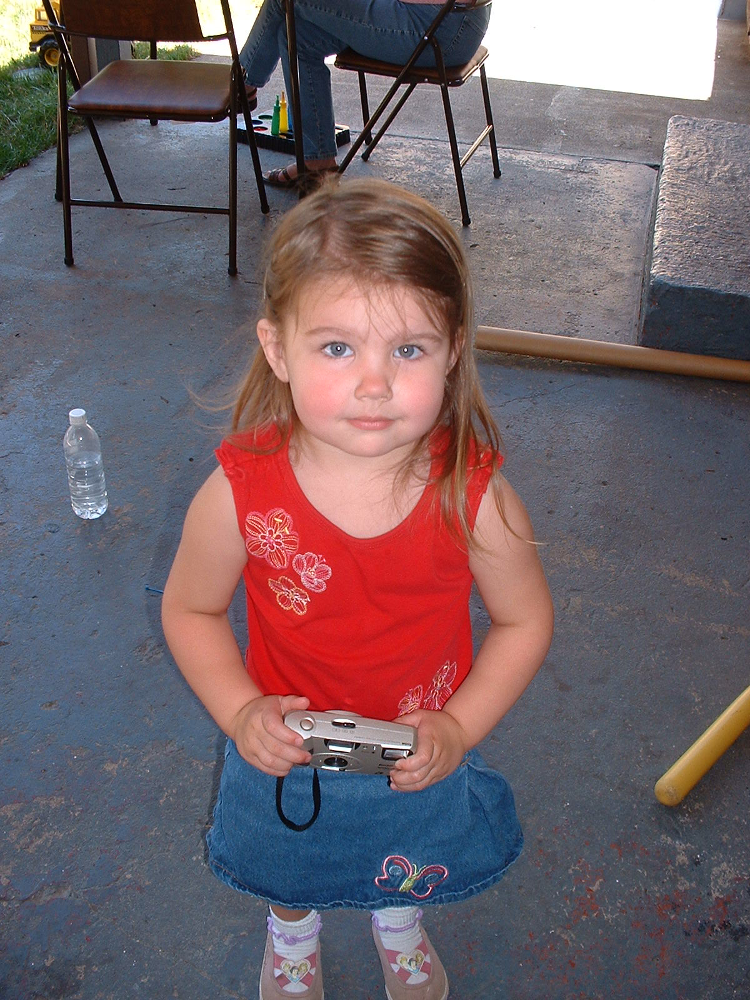

```{r setup, include=FALSE}
knitr::opts_chunk$set(echo = TRUE, fig.align='center', fig.widty='30%')
```

## Renee Harding
### I am a senior OTM student at the University of Portland. I currently work full time at The Home Depot as the supervisor for Pro Sales and the Tool Rental Center. My goal in this position is to provide steady leadership for departments that have not had a consistent supervisor in years, and expand my capabilities and confidence as a leader. Once I graduate, I plan to apply for store support roles within The Home Depot. I hope to enter a role where I can influence inventory decisions.

#### Below is a link to my favorite store:
[Home Depot Website](https://www.homedepot.com/)


**Photo from childhood**

- <span style="text-decoration:underline">Past Employers</span>
  + Plumas School District
  + Plumas District Hospital
  + Cameron Custom Cleaning Co
- <span style="text-decoration:underline">2 Cats as Pets</span>
  + Maddie-*calico*
  + Luna-*gray*
  


Maddie | Luna
---------|-----------
Angry | Happy
Lap cat | Likes to lay nearby
Hungry all the time, but quiet | Screams for food
Doesn't like to be held | Doesn't mind being picked up


